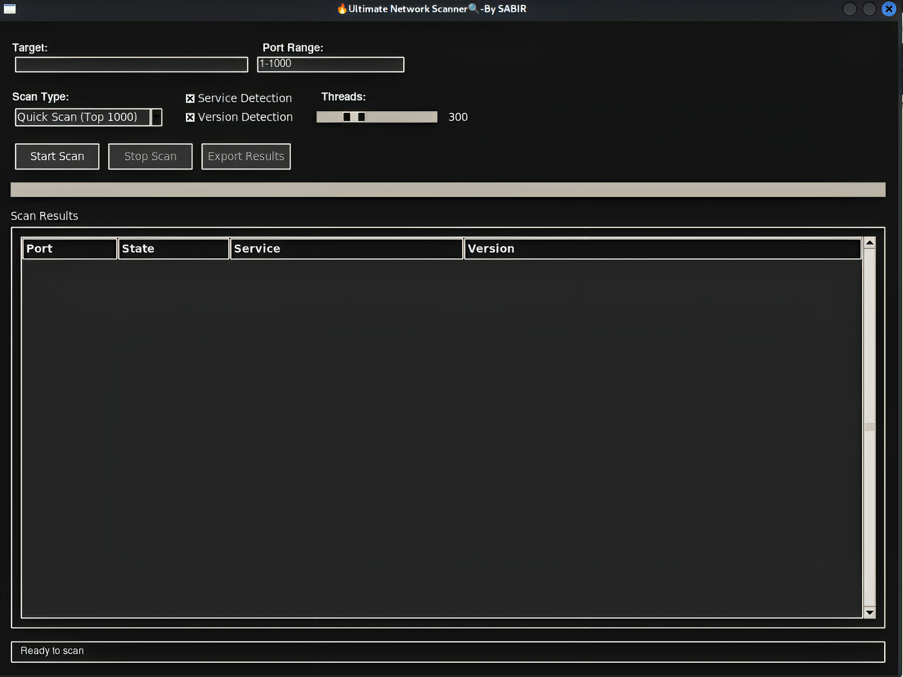
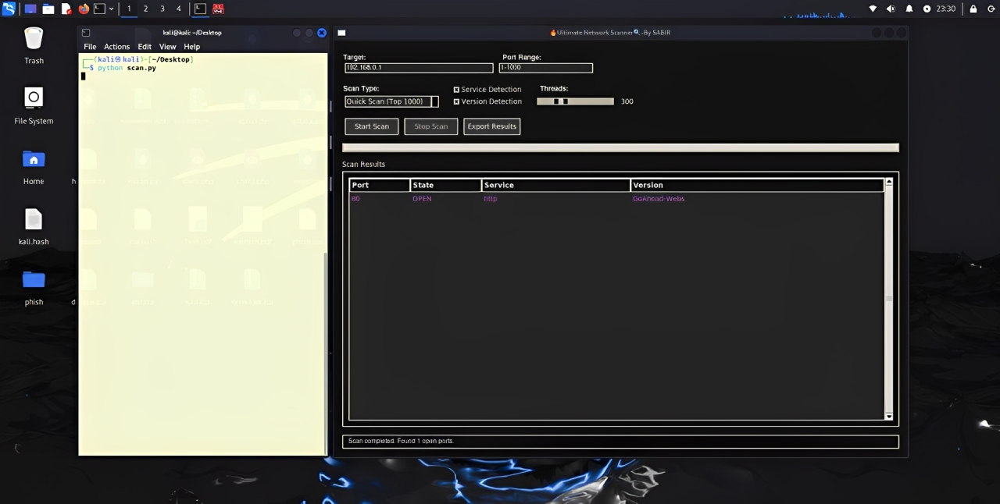

# 🚀 Ultimate Network Scanner - High-Grade Port Scanner

  


**Ultimate Network Scanner** is an **advanced GUI-based port scanner** designed for **security professionals** and **network administrators**. It provides **multi-threaded scanning**, **accurate service detection**, and **customizable scanning options**—all in a sleek and modern interface.

---

## ✨ Features

- ⚡ **Blazing-fast scanning** – Multi-threaded scanning for thousands of ports  
- 🔍 **Accurate version detection** – Identifies running services & versions  
- 🎛️ **Custom scan options** – Choose ports, detection modes & thread count  
- 🌙 **Modern GUI with dark theme** – Stylish & user-friendly  
- 📄 **Export scan results** – Save findings in **JSON** or **CSV**  
- 🎨 **Color-coded output** – Quickly differentiate open/closed ports  

---

## 🌐 Supported Protocols

✅ **Web Servers** – Apache, Nginx, IIS  
✅ **SSH** – OpenSSH, Dropbear  
✅ **FTP** – vsFTPd, ProFTPD, Pure-FTPd  
✅ **Mail Servers** – Postfix, Sendmail, Exim, Exchange  
✅ **DNS Services** – BIND, PowerDNS  
✅ **Databases** – MySQL, PostgreSQL, Redis, MongoDB  
✅ **And many more...**  

---

## 🛠 Installation

### 📌 Prerequisites  
Before installing, ensure you have:
- **Python 3.6+** installed 🐍  
- **Tkinter** (pre-installed with Python on most systems)  

### 📥 Installation Steps

1. **Clone the repository**  
   ```bash
   git clone https://github.com/Sabirtanvir12/unscanner.git
   cd unscanner
   ```  

2. **Install dependencies**  
   ```bash
   pip install -r requirements.txt
   ```
   **or**
   ```bash
   bash setup.sh
   ```
 
3. **Run the application**  
   ```bash
   python3 scan-gui.py
   ```  

### 💻 Windows
1. Download the ZIP file from GitHub and extract it.
2. Open the extracted folder.
3. Right-click inside the folder and select **Open in Terminal**.
4. Run the script using:
```powershell
python scan-gui.py
```
---

## 🚀 Usage

1. **Enter the target IP or hostname**  
2. **Specify the port range** (or use predefined presets)  
3. **Configure scanning options**:  
   - ✅ Service detection  
   - ✅ Version detection  
   - ✅ Adjust thread count  
4. **Click "Start Scan"** 🏁  
5. **View results in an interactive table** 📊  
6. **Export results (JSON/CSV) if needed** 💾  

---

## 📸 Result Screenshots



---

## 🤝 Contributing

🚀 We welcome contributions! Feel free to **submit issues, fork the repo, or create pull requests**.  
  

---

## 📜 License

🔒 This project is licensed under the **MIT License**. See the `LICENSE` file for more details.  

---

## ❤️ Support

If you like this project, don't forget to **⭐ star the repo**! 😊  

📧 For any queries, reach out via **[sabirtanvir10@gmail.com](mailto:sabirtanvir10@gmail.com)** or open an **issue**.  
